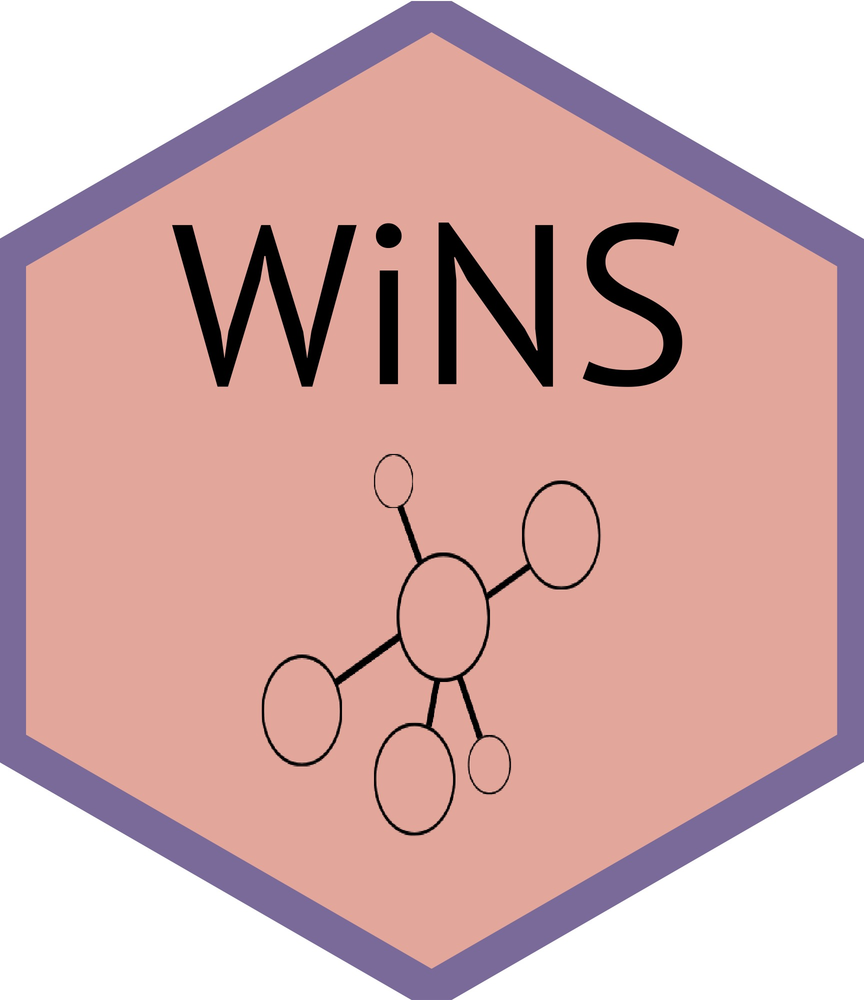

<!-- README.md is generated from README.Rmd. Please edit that file -->

# WiNS Postgraduate repository 

In this repository you will find useful resources for Women in Network Sciences (WiNS) during their postgraduates.  

🖊 Author/Maintainer: **Repository maintain by Postgraduate Committe of WiNS council**. If you would like to add information, or suggest some changes, please contact Francisca Ortiz (Postgraduate rep) by email: **franortizruiz@gmail.com**. 

If this is your first time looking into network science, please visit the next respository ["Starting with networks"](https://github.com/FranciscaOrtizRuiz/wins_startingwithnetworks)

This document is divided in six topics: 1) How to write your thesis. 2) Resources for academic life. 3) How to write articles, documments, reviews, and others. 4) Conferences and other events about networks. 5) Journals about networks. 6) Twitter accounts.

## 1. How to write your thesis. 💻

[Academic Phrasebank](https://www.phrasebank.manchester.ac.uk): General resources for acamic writers. Here you will find examples of how to introduce others work, referring to sources, describing methods, reporting results, discussin findings and writing conclusions. 

[How to do a Literature Review](http://www.raulpacheco.org/resources/literature-reviews/): Blog done by Raul Pacheco-Vega.

[Reading strategies](http://www.raulpacheco.org/resources/reading-strategies/): Blog done by Raul Pacheco-Vega.

[Writing resources from The Universiy of Edinburgh](https://www.ed.ac.uk/institute-academic-development/research-roles/research-only-staff/writing/writing-resources): Resources for research active academics, designed to support your writing. Guides and resources on different writing topics, to give you an opportunity to focus on specific areas of your writing.

[The thesis whisperer](https://thesiswhisperer.com): The Thesis Whisperer is written by Professor Inger Mewburn, director of researcher development at The Australian National University.

[Advice for being a PhD student in Computational Science.](https://www.cs.jhu.edu/~mdredze/publications/HowtoBeaSuccessfulPhDStudent.1_1.pdf)

[Career resources for PhD students - Nature](https://www.nature.com/collections/dhbegcaieb/)

## 2. Resources for academic life. 🌻

[Graduate programs and training by INSNA.](https://www.insna.org/graduate-programs)

[Organization and time management](http://www.raulpacheco.org/resources/organization-and-time-management/): Blog done by Raul Pacheco-Vega about organization and time management.

[Surviving and thriving in academia](http://www.raulpacheco.org/resources/surviving-and-thriving-in-academia/): Blog done by Raul Pacheco-Vega.

[Social media in academia](http://www.raulpacheco.org/resources/social-media-in-academia/): Blog done by Raul Pacheco-Vega.

[WhisperFest Podcast](https://www.buzzsprout.com/1510516): We want to be the kind of academy we want to see: inclusive, empowered, engaged and kind. #Whisperfest is bought to you by the Whisper Collective: The Research Whisperer team, Tseen Khoo and Jonathan O’Donnell, Narelle Lemon from The Wellbeing Whisperer via Explore & Create Co, and The Thesis Whisperer, Inger Mewburn.

[Tips of how to peer-reviewing](https://www.two-cells.com/post/quick-and-essential-tips-to-peer-reviewing)

## 3. How to write articles, documents, reviews, and others. 💻

[Writing an article](https://fish.cgiar.org/getting-published-peer-review-professor-joshua-cinner): The materials are designed and delivered by Professor Joshua Cinner of the Australian Research Council’s Centre of Excellence for Coral Reef Studies, James Cook University. They were produced as part of the science quality and capacity development initiatives under FISH and through the partnership between WorldFish and the Australian Research Council’s Centre of Excellence for Coral Reef Studies, James Cook University. 

[Academic writing](http://www.raulpacheco.org/resources/academic-writing-acwri/): Blog done by Raul Pacheco-Vega about how to do academic writing.

[Academic Phrasebank](https://www.phrasebank.manchester.ac.uk): General resources for acamic writers. Here you will find examples of how to introduce others work, referring to sources, describing methods, reporting results, discussin findings and writing conclusions. 

## 4. Conferences and other events about networks. 🔭 

[WiNS Seminars 2020-21 information](https://aliceschwarze.gitlab.io/winsseminar.html)

[WiNS Seminars 2020-21 videos in YouTube Channel](https://www.youtube.com/channel/UCJppCyVIY5_XsNOSl7mftRQ?view_as=subscriber)

[Twitter Account Networks 2021: A Join Sunbelt & NetSci Conference](https://twitter.com/Networks2021)

[INSNA webpage of events (it is always updated!)](https://www.insna.org/events/)

[Webpage Networks 2021: A Join Sunbelt & NetSci Conference](https://networks2021.net)

[Webpage EUSN 2021 Conference](http://www.eusn2021.unina.it)

## 5. Journals about networks. 💬

[Social Networks. An International Journal of Structural Analysis.](https://www.journals.elsevier.com/social-networks)

[Network Science](https://www.cambridge.org/core/journals/network-science)

[Connections. International Network for Social Network Analysis.](https://www.exeley.com/journal/connections)

[Journal of Social Structure International Network for Social Network Analysis](https://www.exeley.com/journal/journal_of_social_structure)

[REDES. Revista Hispana para el análisis de redes sociales.](https://revistes.uab.cat/redes/index)

## 6. Twitter accounts. 📫 

[WiNS](https://twitter.com/WiNS_Society)

[Network Science Society](https://twitter.com/netscisociety)

[INSNA](https://twitter.com/SocNetAnalysts)

